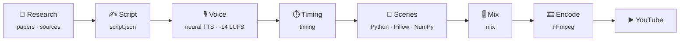

<div align="center">


### *Latoon* (لټون) means **search** in Pashto.
Science, AI, psychology and philosophy — the ideas hiding beneath what we think we already understand.

<br/>

[](https://www.youtube.com/@its_Latoon?sub_confirmation=1)
[](#-shorts)
[](#-long-form)
[](#-the-engine)
[](#-the-engine)

<sub>Every frame of every video is drawn in code. This repository is the source.</sub>

</div>

<br/>

> [!NOTE]
> **No templates, no stock edits.** Each video is a small program: a researched script, a narrated voice track, and Python scenes that paint every frame — layered, shaded, real photographs composited with hand-built diagrams — then mixed and encoded with FFmpeg.

<br/>

## 🎬 Long-form

<table>
  <tr>
    <td width="50%" valign="top" align="center">
      <a href="https://www.youtube.com/watch?v=Nid0y8arPQw"></a><br/>
      <b>Catching a Ghost: The Nobel-Winning Telescope Made of Ice</b><br/>
      <sub>IceCube, a cubic kilometre of Antarctic ice, and the particles that pass through you by the trillion.</sub><br/>
      <sub><a href="videos/2026-10-08-icecube-catching-a-ghost">source</a> · <a href="https://www.youtube.com/watch?v=Nid0y8arPQw">watch ▶</a></sub>
    </td>
    <td width="50%" valign="top" align="center">
      <a href="https://www.youtube.com/watch?v=NltlRQh7Azo"></a><br/>
      <b>How Neural Networks Learn to See</b><br/>
      <sub>From random numbers to vision: backpropagation and gradient descent, shown step by step.</sub><br/>
      <sub><a href="videos/2026-10-08-random-numbers-learn-to-see">source</a> · <a href="https://www.youtube.com/watch?v=NltlRQh7Azo">watch ▶</a></sub>
    </td>
  </tr>
</table>

## ⚡ Shorts

**Latest**

<table>
  <tr>
    <td align="center" width="33%" valign="top">
      <a href="https://youtube.com/shorts/P_7-m7Ay4sY"></a><br/>
      <sub><b>3 Stars Born Together, 3 Different Fates: Pulsar Triple</b></sub><br/>
      <sub><a href="shorts/2026-10-09-23-pulsartriple">code</a> · <a href="https://youtube.com/shorts/P_7-m7Ay4sY">watch ▶</a></sub>
    </td>
    <td align="center" width="33%" valign="top">
      <a href="https://youtube.com/shorts/xb51381ofn0"></a><br/>
      <sub><b>A Robot Hand That Walks on Its Fingertips</b></sub><br/>
      <sub><a href="shorts/2026-10-09-22-fingerwalk">code</a> · <a href="https://youtube.com/shorts/xb51381ofn0">watch ▶</a></sub>
    </td>
    <td align="center" width="33%" valign="top">
      <a href="https://youtube.com/shorts/GR5Eya2Ft8I"></a><br/>
      <sub><b>Nobel Chemistry 2026: Why Life Is One-Handed</b></sub><br/>
      <sub><a href="shorts/2026-10-09-21-chirality">code</a> · <a href="https://youtube.com/shorts/GR5Eya2Ft8I">watch ▶</a></sub>
    </td>
  </tr>
  <tr>
    <td align="center" width="33%" valign="top">
      <a href="https://youtube.com/shorts/iXjZF9-daJA"></a><br/>
      <sub><b>Diffie-Hellman Explained: A Secret in Public</b></sub><br/>
      <sub><a href="shorts/2026-10-09-20-diffie">code</a> · <a href="https://youtube.com/shorts/iXjZF9-daJA">watch ▶</a></sub>
    </td>
    <td align="center" width="33%" valign="top">
      <a href="https://youtube.com/shorts/DUtcTcWhV4Q"></a><br/>
      <sub><b>Gravitational Lenses: AI Found 70 Natural Telescopes</b></sub><br/>
      <sub><a href="shorts/2026-10-09-19-lenses">code</a> · <a href="https://youtube.com/shorts/DUtcTcWhV4Q">watch ▶</a></sub>
    </td>
    <td align="center" width="33%" valign="top">
      <a href="https://youtube.com/shorts/f4p-CCBC1LQ"></a><br/>
      <sub><b>Hopfield Network Built From Atoms and Light: 7x More Memory</b></sub><br/>
      <sub><a href="shorts/2026-10-09-18-hopfield">code</a> · <a href="https://youtube.com/shorts/f4p-CCBC1LQ">watch ▶</a></sub>
    </td>
  </tr>
</table>

<details>
<summary><b>📚 Full catalogue</b> &nbsp;·&nbsp; 🤖 AI & tech &nbsp; 🔭 science &nbsp; 🧠 mind & brain &nbsp; 🏛️ philosophy</summary>
<br/>

| | Short | Source |
|:-:|:--|:-:|
| 🔭 | [3 Stars Born Together, 3 Different Fates: Pulsar Triple](https://youtube.com/shorts/P_7-m7Ay4sY) | [`2026-10-09-23-pulsartriple`](shorts/2026-10-09-23-pulsartriple) |
| 🤖 | [A Robot Hand That Walks on Its Fingertips](https://youtube.com/shorts/xb51381ofn0) | [`2026-10-09-22-fingerwalk`](shorts/2026-10-09-22-fingerwalk) |
| 🔭 | [Nobel Chemistry 2026: Why Life Is One-Handed](https://youtube.com/shorts/GR5Eya2Ft8I) | [`2026-10-09-21-chirality`](shorts/2026-10-09-21-chirality) |
| 🤖 | [Diffie-Hellman Explained: A Secret in Public](https://youtube.com/shorts/iXjZF9-daJA) | [`2026-10-09-20-diffie`](shorts/2026-10-09-20-diffie) |
| 🔭 | [Gravitational Lenses: AI Found 70 Natural Telescopes](https://youtube.com/shorts/DUtcTcWhV4Q) | [`2026-10-09-19-lenses`](shorts/2026-10-09-19-lenses) |
| 🤖 | [Hopfield Network Built From Atoms and Light: 7x More Memory](https://youtube.com/shorts/f4p-CCBC1LQ) | [`2026-10-09-18-hopfield`](shorts/2026-10-09-18-hopfield) |
| 🤖 | [How Does AI Know Puppy Means Dog? Embeddings Explained](https://youtube.com/shorts/01ftDajOe4c) | [`2026-10-09-16-embeddings`](shorts/2026-10-09-16-embeddings) |
| 🔭 | [Your Brainstem Predicts What You'll Feel Before It Happens](https://youtube.com/shorts/VYfe493ev7I) | [`2026-10-09-14-colliculus`](shorts/2026-10-09-14-colliculus) |
| 🤖 | [Your AI Just Learned to Find Genes in Raw DNA](https://youtube.com/shorts/Ln-HFhrAMKk) | [`2026-10-09-12-carbon`](shorts/2026-10-09-12-carbon) |
| 🔭 | [Most Distant Fast Radio Burst: A Flash From 10 Billion Years Ago](https://youtube.com/shorts/mNd89xt0q7M) | [`2026-10-09-10-frb`](shorts/2026-10-09-10-frb) |
| 🤖 | [Brain-IT: AI Redraws What You See From a Brain Scan](https://youtube.com/shorts/OE-1P1S_RwY) | [`2026-10-09-08-brainit`](shorts/2026-10-09-08-brainit) |
| 🤖 | [Your AI Can't See Letters. Byte-Level LLMs Explained](https://youtube.com/shorts/34Nn3bdGrRg) | [`2026-10-08-22-bytes`](shorts/2026-10-08-22-bytes) |
| 🤖 | [How Does AI Draw a Picture From Pure Static?](https://youtube.com/shorts/NMuqTM1_kZE) | [`2026-10-08-20-diffusion`](shorts/2026-10-08-20-diffusion) |
| 🤖 | [ChatGPT Answers Can Now Be Apps: Intelligent UI](https://youtube.com/shorts/5ynzGKjUxLE) | [`2026-10-08-18-intelligent-ui`](shorts/2026-10-08-18-intelligent-ui) |
| 🏛️ | [Ship of Theseus: Is It Still the Same Ship?](https://youtube.com/shorts/r4Sn2fFPP3Y) | [`2026-10-08-16-theseus`](shorts/2026-10-08-16-theseus) |
| 🤖 | [How Can a Website Check Your Password Without Knowing It?](https://youtube.com/shorts/c7zmujbQnIs) | [`2026-10-08-14-hashing`](shorts/2026-10-08-14-hashing) |
| 🔭 | [BC200: A Brain Gene That Still Jumps Through DNA](https://youtube.com/shorts/NZdjF65eYbU) | [`2026-10-08-12-bc200`](shorts/2026-10-08-12-bc200) |
| 🤖 | [How Does AI Know What "It" Means? Attention Explained](https://youtube.com/shorts/ZS6h-3-QJ0Y) | [`2026-10-08-10-attention`](shorts/2026-10-08-10-attention) |
| 🤖 | [How Does AI Actually Learn? Gradient Descent](https://youtube.com/shorts/5c_WxXdnM10) | [`2026-10-07-22-gradient`](shorts/2026-10-07-22-gradient) |
| 🤖 | [How Does ChatGPT Actually Read? Tokens Explained](https://youtube.com/shorts/0zRpabf-1nk) | [`2026-10-07-20-tokens`](shorts/2026-10-07-20-tokens) |
| 🧠 | [Google Effect: Your Brain Lets Go of Saved Things](https://youtube.com/shorts/CNrZZ0QTC7c) | [`2026-10-07-18-google-effect`](shorts/2026-10-07-18-google-effect) |
| 🤖 | [openTPU: An AI Chip That Waits on Memory](https://youtube.com/shorts/U5fRWKoKJFE) | [`2026-10-07-16-opentpu`](shorts/2026-10-07-16-opentpu) |
| 🤖 | [EmbeddingGemma 2: One Map for Photos, Sound and Text](https://youtube.com/shorts/cocTCMlUSxU) | [`2026-10-07-14-embeddinggemma2`](shorts/2026-10-07-14-embeddinggemma2) |
| 🤖 | [Mistral Large 4: 1 Trillion Parameters, Mostly Asleep](https://youtube.com/shorts/JidyWNOLAuw) | [`2026-10-07-12-mistral-large-4`](shorts/2026-10-07-12-mistral-large-4) |
| 🧠 | [Claustrum: The Brain's Most Hidden Hub, Recorded](https://youtube.com/shorts/Pv5xYtCnYKg) | [`2026-10-07-10-claustrum`](shorts/2026-10-07-10-claustrum) |
| 🔭 | [Nobel Prize in Physics 2026: A Telescope Made of Ice](https://youtube.com/shorts/Tt9ar_B2Oo8) | [`2026-10-07-08-icecube-nobel`](shorts/2026-10-07-08-icecube-nobel) |
| 🤖 | [OpenAI Dots vs Grok Bot: AI Agents Got Their Own Computers](https://youtube.com/shorts/oC-dv4-Z5pw) | — |

</details>

<br/>

## ⚙️ The engine



| Stage | What happens | File |
|---|---|---|
| **Research** | Fresh, sourced topics scored for novelty, credibility and fit | `sources.md` |
| **Script** | One narrative thread, a real hook, a payoff — never narrating the visuals | `script.json` |
| **Voice** | Natural neural narration, paced and mastered to broadcast loudness | private engine |
| **Scenes** | Every frame drawn in Python: real imagery, layered diagrams, motion | `scenes.py` |
| **Mix & encode** | Narration, subtle sound design and captions, encoded with FFmpeg | private engine |

## 🗂️ Repository

```text
LATOON/
├── videos/<date-topic>/ one folder per long-form video
└── shorts/<date-topic>/ one folder per Short
```

Each folder holds the scene code, narration script, metadata, captions and sources. Rendered video, audio and photographs are not stored here; third-party images are credited in each video's description.

## 🔒 About the code

Each folder shares the parts that make that video unique: the narration script, its scene code, metadata and sources. The shared rendering, voice and audio engine is private.

<br/>

<div align="center">

**Search deeper. Question further. Voyage the unseen.**

[](https://www.youtube.com/@its_Latoon?sub_confirmation=1)


</div>
